# Leitor

## Collaborators
* [Daniel Martins Vieira](https://github.com/Idalen) (11215719)

---

## Abstract

Leitor project has the main goal of converting images of texts into machine-encoded text. In other words, the program will extract the text from an image which contains it written or printed and will turn it into a string of characters.

At first, for the sake of simplicity, the project scope will only cover images of white background pages containing printed text. These images are taken from screenshots of websites or photographies of books. These images may have noise, blur and uncontrolled lighting conditions.

This objective must be achieved using digital image processing techniques.

---

## Inputs

Here are some few scaled down example images that will have their embedded text extracted.

* Scanned Text Snippet 
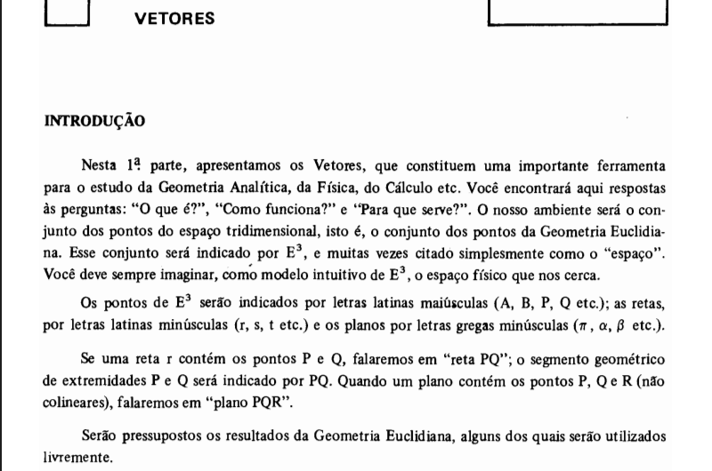

* Website Screenshot 
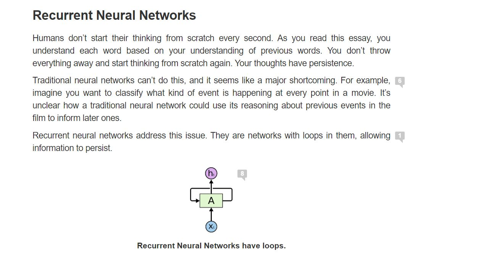
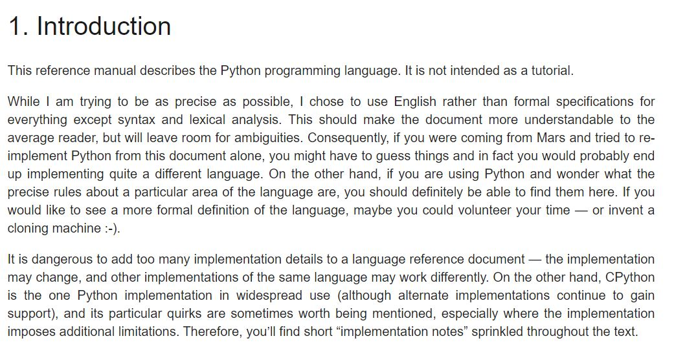

* Book Page Photo  
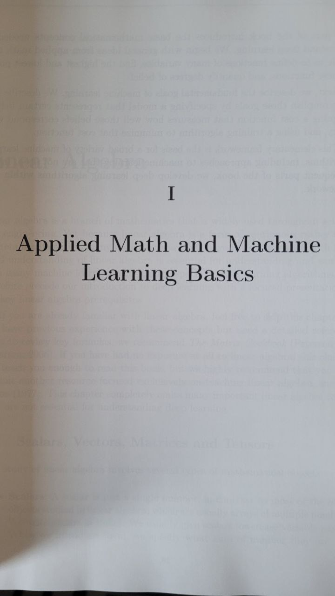
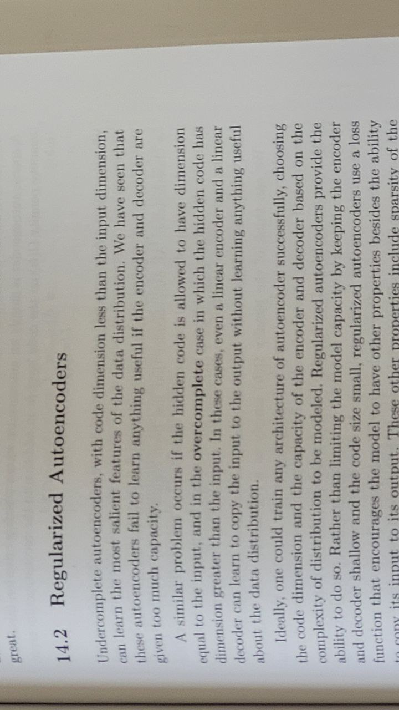

All images below were taken by the members of the project with a cellphone camera or taking screenshots from webpages on the internet.

---

## Methods

Below are a diagram which contains the steps this projects will follow:

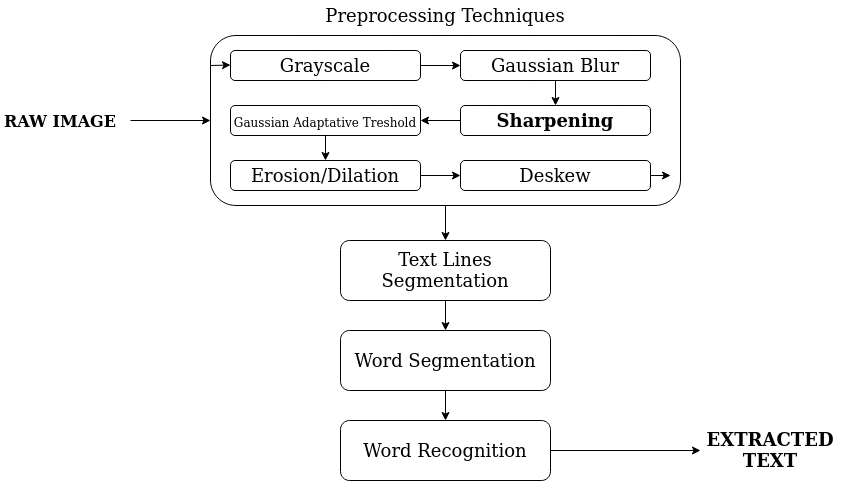

The project will apply these techniques in order to achieve its objective:

### Grayscaling

Once the text is generally not affected by color, the images are converted into grayscale in order to manipulate them easier.

### Blur

A small gaussian blur is applied to smooth out the image and thus reduce the noise in it. With the image smoothed out, treshould approaches can perform better.

### Sharpening

Since the image was blurred to remove some noise, now  a laplacian sharpening filter must be used in order to make the image more defined. Thus, further processing can achieve better results.

### Gaussian Adaptative Treshoulsing

Now our goal is to find areas with text, i.e. text blocks of the image. To make text block detection easier we will invert and maximize the colors of our image, that will be achieved via thresholding. So now text becomes white and background is black. Gaussian adaptative tresholding is used in this due it better performances in images with noise and uncontrolled lighting, as you can see.

Below you can see the differences between binarization results whether denoise is applied or not.

When denoise and sharpening are applied
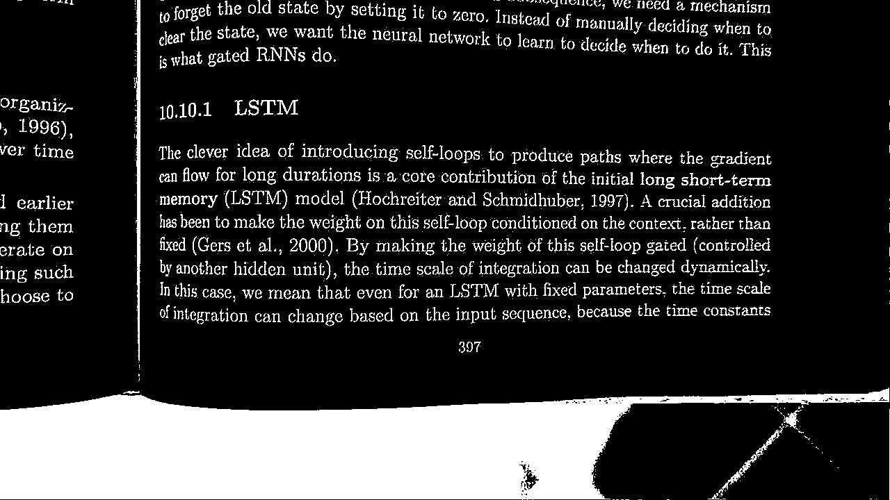

When not
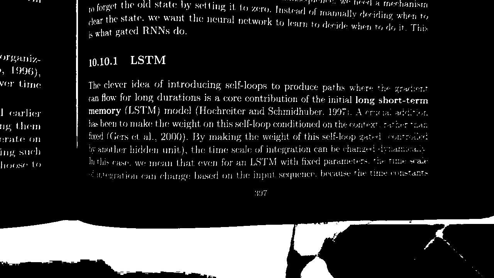

### Erosion/Dilation

Although the last preprocessing techniques applied in order to prepare the image for the text extraction, it also highlight some persistant noise. 

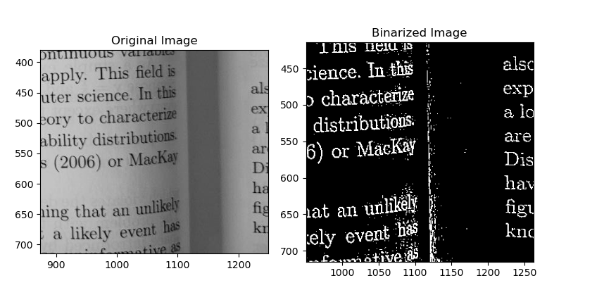

Therefore, we used morphological operations to handle this problem, as you can see below:

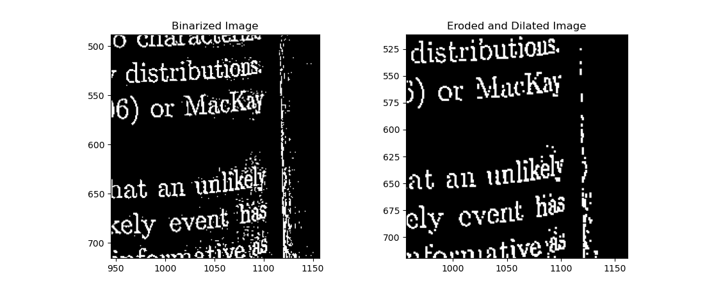

Although the erosion and dilation techniques helped a lot with the remaining noise, it also caused some issues with some text areas:

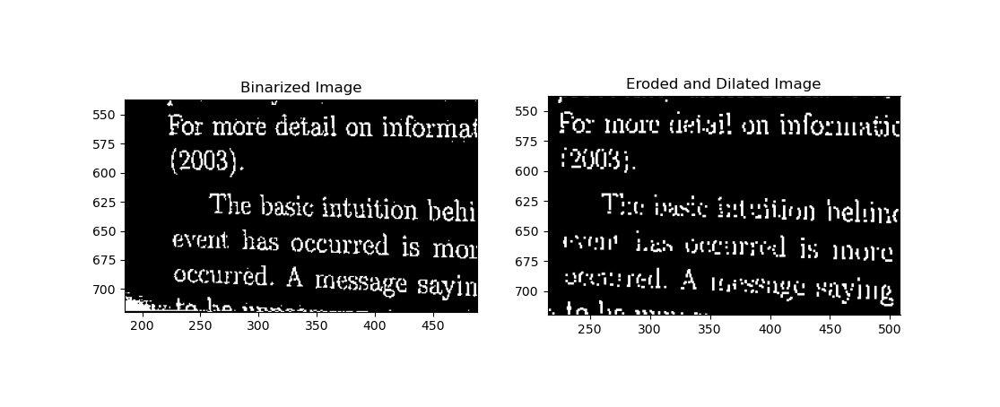

This issue, until this moment, has no solution. 

### Deskew

In other to achieve better performances with the futher steps of this project, the images are rotated to compensate for skewing. To achieve this, dilation is used to define the lines, so Hough Lines algorithm can detect straight lines in the image and compute the skewing angle.

With the steps done, we can use the given angle to rotate the image properly. Some examples can be seen below.

Before deskewing
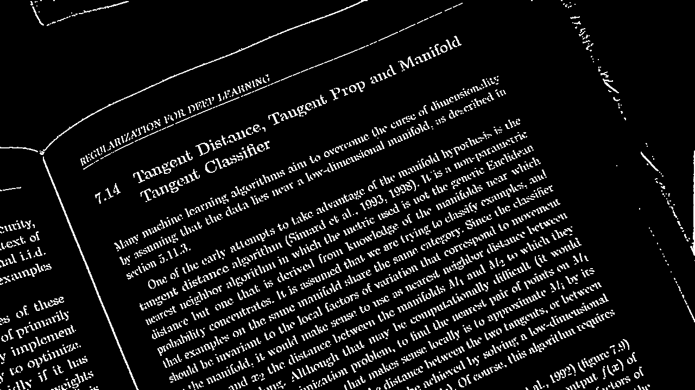

After deskewing
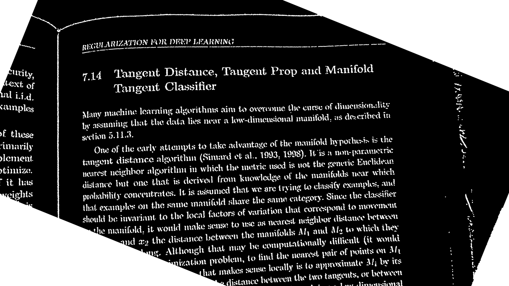

## Next Steps

### Line Segmentation

For line segmentation, an Unet convolutional neural network will be used. It will be trained with preprocessed images as its inputs and manually anotated groundtruth images that will represent the desired output from the CNN. The Unet architecture can be seen below.

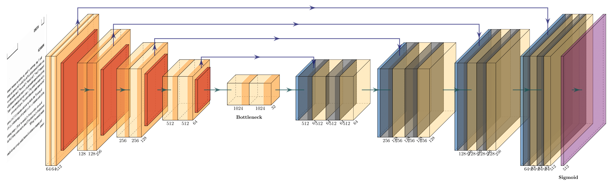

### Word Segmentation

ideas: Map blank spaces in line

### Word Matching

ideas: CNN, morphological hit-miss, pattern matching

---

