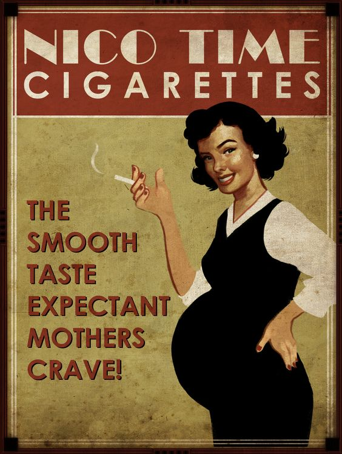

# Leitor

## Collaborators
* [Daniel Martins Vieira](https://github.com/Idalen) (11215719)
* [Guilherme Alves Lindo](https://github.com/Guial07) (8504480)
* [Jayro Boy Neto](https://github.com/jayroboy) (9762880)
* [Marcus Vinícius Santos](https://github.com/marcus_v_rodrigues) (11218862)

---

## Abstract

The project's main goal is to convert images of printed text into machine-encoded text. This must me done using digital image processing techniques.

---

## Inputs

Here are some example images that will have their embedded text extracted.

* Scanned Text Snippet

* Old Cigarettes Advertising

* Document Photo

* Movie Subtitles

---

## Methods

The project expects the use of the following techniques:

### Image Enhancement and Filtering

In order to reduce noise and detect transistions, some sort of enhancement and filtering image processing technique will be used.

### Image Segmentation

For text extraction from image and then separate each character from the text, the project may use some kind of segmentation techniques.

### Pattern Matching

The project will use some kind of pattern recognition technique to identify the characters extracted in segmentation step.
For this task, image correlation and feature extraction may be used.

---

