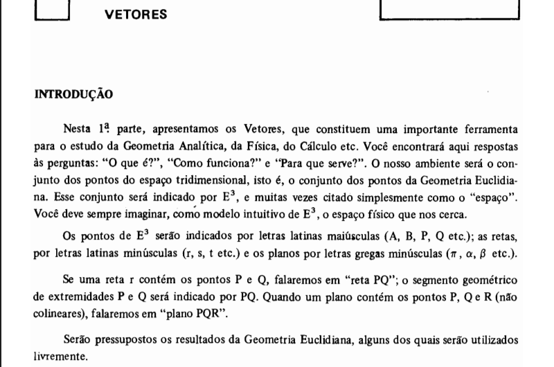
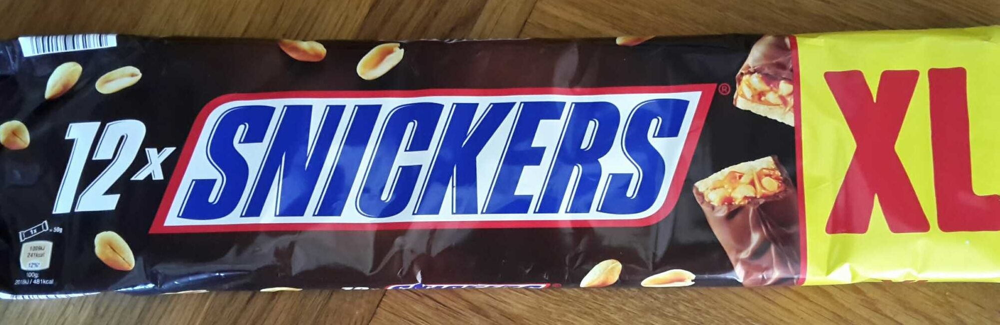
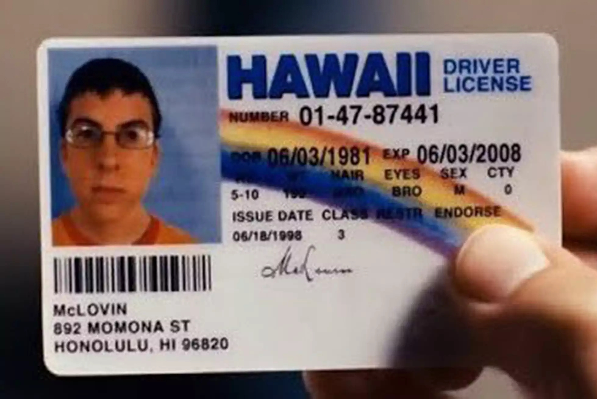
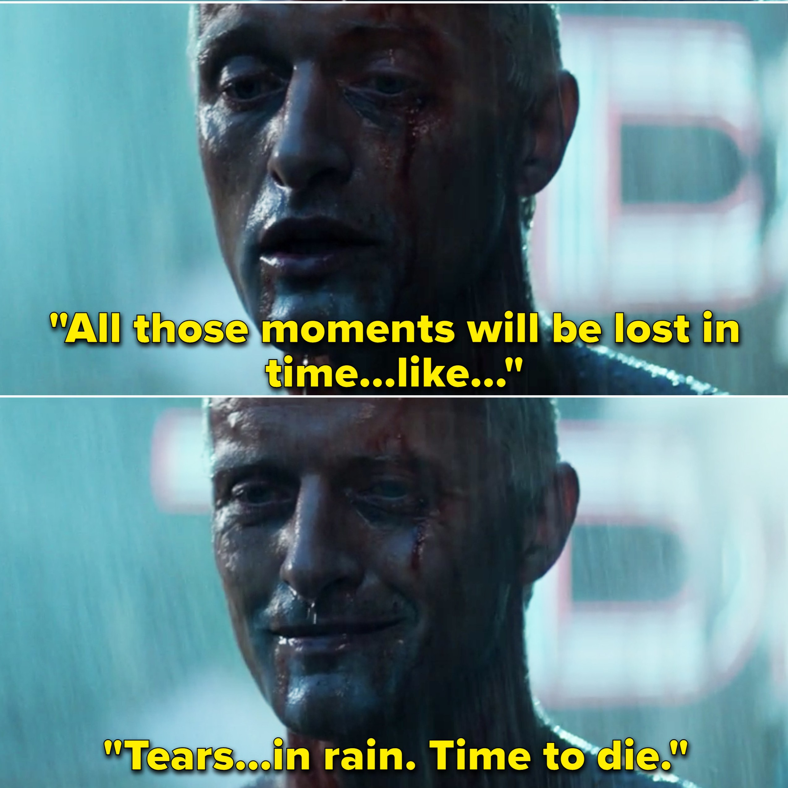

# Leitor

## Collaborators
* [Daniel Martins Vieira](https://github.com/Idalen) (11215719)
* [Guilherme Alves Lindo](https://github.com/Guial07) (8504480)
* [Jayro Boy Neto](https://github.com/jayroboy) (9762880)
* [Marcus Vinícius Santos](https://github.com/marcus_v_rodrigues) (11218862)

---

## Abstract

The project's main goal is to convert images of text into machine-encoded text. This must be done using digital image processing techniques.

---

## Inputs

Here are some example images that will have their embedded text extracted.

* Scanned Text Snippet 

* Food Packaging 

* Document Photo  

* Movie Subtitles  

---

## Methods

The project expects the use of the following techniques:

### Image Enhancement and Filtering

In order to reduce noise and detect transistions, some sort of enhancement and filtering image processing technique will be used.

### Image Segmentation

For text extraction from image and then separate each character from the text, the project may use some kind of segmentation techniques.

### Pattern Matching

The project will use some kind of pattern recognition technique to identify the characters extracted in segmentation step.
For this task, image correlation, feature extraction and machine learning algorithms may be used.

---

## Data

The data used in this project was found on kaggle:
* [Text images](https://www.kaggle.com/datasets/volkandl/optical-character-recognition-ocr-texts)
* [Characters Images](https://www.kaggle.com/datasets/preatcher/standard-ocr-dataset)

---
